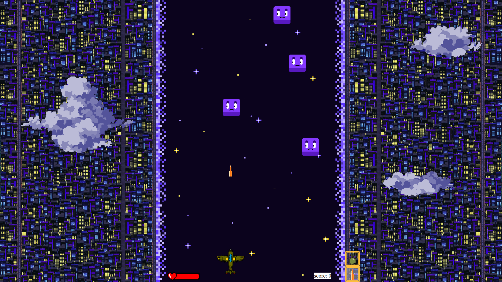

# A JS game

OK. This is how i started javascript.
It's a game in vanilla JS. i know, i know, people use canvas for game development in JS but my main goal was learning JS and DOM.

  
   

## How to run the game
Just download the repo and run index.html in your browser.
